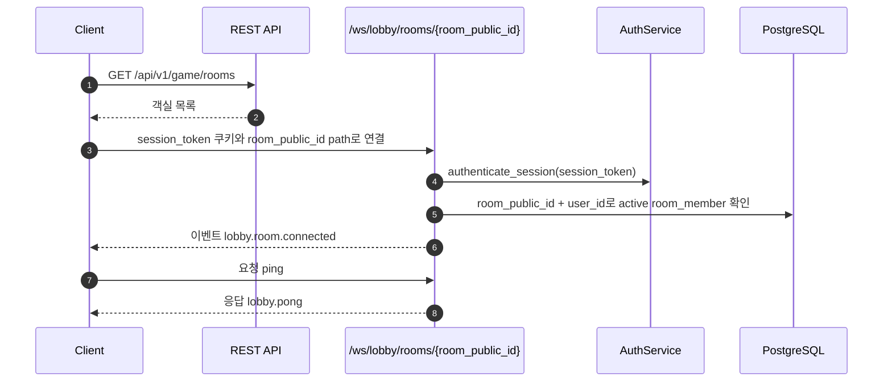
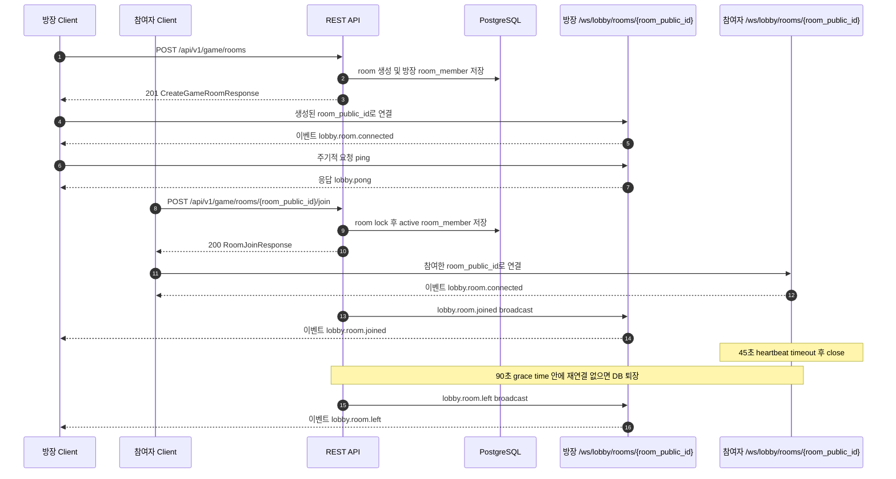
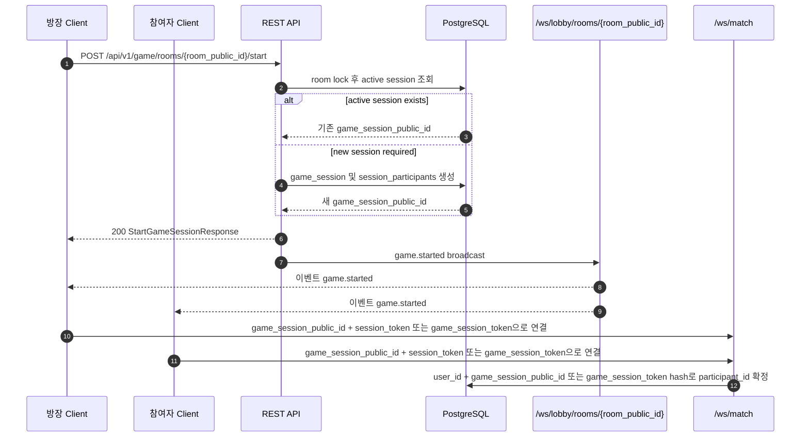

# WebSocket API

BE 서버의 WebSocket 명세 문서입니다. HTTP API 계약은 Swagger와 `docs/api.md`에서 관리하고,
이 문서는 WebSocket 연결 방식, 메시지 방향, 요청/응답/이벤트 payload를 구분해 설명합니다.

## 개요

| 엔드포인트 | 상태 | 인증 | 용도 |
| --- | --- | --- | --- |
| `/ws/lobby/rooms/{room_public_id}` | 사용 중 | `session_token` 쿠키, 활성 room member | 특정 객실 로비 연결, 객실 이벤트 수신 |
| `/ws/realtime` | 사용 중 | 없음 | 연결 테스트용 ping/pong |
| `/ws/match` | 예정 | `session_token` + `game_session_public_id` 또는 `game_session_token`으로 참가자 identity 고정 | 게임 진행, 턴, 점수, 투표 |

로비의 객실 목록 조회, 객실 생성, 객실 참여, 명시적 객실 퇴장은 REST API가 담당합니다. WebSocket은
이미 참여가 허용된 객실의 실시간 이벤트를 받기 위해 연결합니다. 영속 상태는 DB가 소유하고,
WebSocket manager는 현재 열린 연결, 유저 identity, 객실별 연결 registry 같은 process-local 상태만
보관합니다.

## 공통 메시지 규칙

모든 text frame은 JSON object envelope입니다.

| 필드 | 타입 | 필수 | 설명 |
| --- | --- | --- | --- |
| `type` | string | 예 | 메시지 종류 |
| `payload` | object | 예 | 메시지 본문 |

클라이언트 요청 예시:

```json
{
  "type": "ping",
  "payload": {
    "client_time": "2026-06-12T00:00:00+09:00"
  }
}
```

서버 응답 예시:

```json
{
  "type": "lobby.pong",
  "payload": {
    "client_time": "2026-06-12T00:00:00+09:00"
  }
}
```

## 메시지 방향

| 구분 | 방향 | 의미 |
| --- | --- | --- |
| 요청(Request) | Client -> Server | 클라이언트가 서버에 보내는 command 또는 query |
| 응답(Response) | Server -> Client | 특정 요청에 대한 즉시 응답 |
| 이벤트(Event) | Server -> Client | 연결, REST API, 게임 상태 변경으로 발생하는 push |
| 오류(Error) | Server -> Client, then close | 계약 위반 또는 인증/권한 실패에 대한 오류 |

## 로비 WebSocket

### 연결

| 환경 | URL |
| --- | --- |
| 운영 | `wss://<host>/ws/lobby/rooms/{room_public_id}` |
| 로컬 | `ws://127.0.0.1:8000/ws/lobby/rooms/{room_public_id}` |

브라우저 WebSocket handshake에 포함된 HttpOnly `session_token` 쿠키로 연결 시점에 로그인 세션을
확인합니다. 그 다음 path의 `room_public_id`로 객실을 조회하고, 현재 유저가 활성 `room_members`에
포함되어 있는지 확인합니다. 세션 인증 실패, 객실 없음, 객실 멤버 아님은 모두 `1008` close code로
닫습니다.

클라이언트는 먼저 REST API로 객실 목록을 조회하거나 객실을 생성/참여한 뒤, 허용된
`room_public_id`로 이 WebSocket path에 연결합니다. 별도 `subscribe_room` 메시지는 사용하지 않습니다.

클라이언트는 연결 유지 확인을 위해 주기적으로 `ping`을 보내야 합니다. 서버는 마지막 메시지 이후
45초 동안 새 메시지를 받지 못하면 WebSocket을 `1001` close code로 닫습니다. 연결이 닫혀도 즉시
DB 퇴장 처리하지 않고, 90초 grace time 안에 같은 유저가 같은 방으로 재연결하면 퇴장을 취소합니다.
grace time이 지나도 복귀하지 않으면 `room_members.left_at`을 기록하고 같은 방 연결에
`lobby.room.left` 이벤트를 보냅니다.

### 이벤트(Event): `lobby.room.connected`

방향: Server -> 연결된 client

발생 시점: `/ws/lobby/rooms/{room_public_id}` 연결과 room member 검증 성공

Payload:

| 필드 | 타입 | 설명 |
| --- | --- | --- |
| `room_public_id` | uuid | 연결이 허용된 객실 public ID |
| `user.public_id` | uuid | 외부 노출 유저 ID |
| `user.account_id` | string | 로그인 계정 ID |
| `user.nickname` | string | 현재 닉네임 |

예시:

```json
{
  "type": "lobby.room.connected",
  "payload": {
    "room_public_id": "018fd0c5-6e1a-7c8e-9b1d-4f99e4a20b7e",
    "user": {
      "public_id": "018fd0c5-6e1a-7c8e-9b1d-4f99e4a20b7f",
      "account_id": "player_001",
      "nickname": "초보자"
    }
  }
}
```

### 이벤트(Event): `lobby.room.snapshot`

방향: Server -> 연결된 client

발생 시점: `lobby.room.connected` 전송 직후

목적: 방 화면 진입 또는 재접속 시 현재 활성 멤버 리스트를 초기화합니다. 이후 변경분은
`lobby.room.joined`, `lobby.room.left` 이벤트로 반영합니다.

Payload:

| 필드 | 타입 | 설명 |
| --- | --- | --- |
| `room_public_id` | uuid | snapshot 대상 객실 public ID |
| `owner_user_public_id` | uuid 또는 null | 현재 방장 public ID |
| `members` | array | 활성 room member 목록. `joined_at` 오름차순 |
| `members[].user_public_id` | uuid | 멤버 유저 public ID |
| `members[].nickname` | string | 멤버 닉네임 |
| `members[].is_owner` | boolean | 현재 방장 여부 |
| `members[].joined_at` | datetime | 객실 멤버십 생성 시각 |

예시:

```json
{
  "type": "lobby.room.snapshot",
  "payload": {
    "room_public_id": "018fd0c5-6e1a-7c8e-9b1d-4f99e4a20b7e",
    "owner_user_public_id": "018fd0c5-6e1a-7c8e-9b1d-4f99e4a20b7f",
    "members": [
      {
        "user_public_id": "018fd0c5-6e1a-7c8e-9b1d-4f99e4a20b7f",
        "nickname": "초보자",
        "is_owner": true,
        "joined_at": "2026-06-12T00:00:00+09:00"
      },
      {
        "user_public_id": "018fd0c5-6e1a-7c8e-9b1d-4f99e4a20b80",
        "nickname": "손님",
        "is_owner": false,
        "joined_at": "2026-06-12T00:01:00+09:00"
      }
    ]
  }
}
```

### 요청(Request): `ping`

방향: Client -> Server

목적: 연결과 message round-trip 확인

Payload:

| 필드 | 타입 | 설명 |
| --- | --- | --- |
| any | any | 서버가 그대로 echo할 object payload |

예시:

```json
{
  "type": "ping",
  "payload": {
    "client_time": "2026-06-12T00:00:00+09:00"
  }
}
```

### 응답(Response): `lobby.pong`

방향: Server -> 요청 client

대응 요청: `ping`

예시:

```json
{
  "type": "lobby.pong",
  "payload": {
    "client_time": "2026-06-12T00:00:00+09:00"
  }
}
```

### 이벤트(Event): `lobby.room.joined`

방향: Server -> 같은 객실에 연결된 client

발생 시점: `POST /api/v1/game/rooms/{room_public_id}/join` 성공 중 신규 멤버가 추가된 경우
(`already_member=false`)

Payload:

| 필드 | 타입 | 설명 |
| --- | --- | --- |
| `room_public_id` | uuid | 참여한 객실 public ID |
| `user_public_id` | uuid | 참여한 유저 public ID |
| `nickname` | string | 참여 유저 닉네임 |
| `joined_at` | datetime | 객실 멤버십 생성 시각 |
| `already_member` | boolean | 이 event에서는 항상 `false` |

예시:

```json
{
  "type": "lobby.room.joined",
  "payload": {
    "room_public_id": "018fd0c5-6e1a-7c8e-9b1d-4f99e4a20b7e",
    "user_public_id": "018fd0c5-6e1a-7c8e-9b1d-4f99e4a20b7f",
    "nickname": "초보자",
    "joined_at": "2026-06-12T00:00:00+09:00",
    "already_member": false
  }
}
```

### 이벤트(Event): `lobby.room.left`

방향: Server -> 같은 방에 연결된 client

발생 시점: `POST /api/v1/game/rooms/{room_public_id}/leave` 성공 또는 WebSocket 연결 종료 후 grace
time 안에 같은 유저가 같은 방으로 재연결하지 않음

Payload:

| 필드 | 타입 | 설명 |
| --- | --- | --- |
| `room_public_id` | uuid | 퇴장 처리된 방 public ID |
| `user_public_id` | uuid | 퇴장 처리된 유저 public ID |
| `nickname` | string | 퇴장 처리된 유저 닉네임 |
| `left_at` | datetime | DB에 기록된 퇴장 시각 |
| `remaining_member_count` | number | 퇴장 후 남은 활성 멤버 수 |
| `new_owner_user_public_id` | uuid 또는 null | 방장이 승계된 경우 새 방장 public ID |
| `new_owner_nickname` | string 또는 null | 방장이 승계된 경우 새 방장 닉네임 |
| `room_closed` | boolean | 마지막 멤버 퇴장으로 room이 닫혔는지 여부 |

예시:

```json
{
  "type": "lobby.room.left",
  "payload": {
    "room_public_id": "018fd0c5-6e1a-7c8e-9b1d-4f99e4a20b7e",
    "user_public_id": "018fd0c5-6e1a-7c8e-9b1d-4f99e4a20b7f",
    "nickname": "초보자",
    "left_at": "2026-06-12T00:00:00+09:00",
    "remaining_member_count": 1,
    "new_owner_user_public_id": "018fd0c5-6e1a-7c8e-9b1d-4f99e4a20b80",
    "new_owner_nickname": "다음방장",
    "room_closed": false
  }
}
```

### 이벤트(Event): `game.started`

방향: Server -> 같은 객실에 연결된 client

발생 시점: `POST /api/v1/game/rooms/{room_public_id}/start` 성공

REST start API가 세션 생성을 확정한 뒤 로비에서 매치로 넘어가는 handoff용으로 broadcast합니다.
방 전체 공통 payload에는 사용자별 `game_session_token`을 포함하지 않습니다.

Payload:

| 필드 | 타입 | 설명 |
| --- | --- | --- |
| `room_public_id` | uuid | 시작된 객실 public ID |
| `game_session_public_id` | uuid | match 연결에 사용할 게임 세션 public ID |
| `game_type` | string | 게임 종류 |
| `status` | string | 시작된 게임 세션 상태 |
| `participants` | array | 시작 시 고정된 참가자 snapshot |

## Realtime WebSocket

`/ws/realtime`은 연결 테스트용 ping/pong 채널입니다. 게임 상태를 소유하거나 broadcast하지 않습니다.

| 환경 | URL |
| --- | --- |
| 운영 | `wss://<host>/ws/realtime` |
| 로컬 | `ws://127.0.0.1:8000/ws/realtime` |

### 요청(Request): `ping`

방향: Client -> Server

예시:

```json
{
  "type": "ping",
  "payload": {
    "client_time": "2026-06-11T00:00:00+09:00"
  }
}
```

### 응답(Response): `realtime.pong`

방향: Server -> 요청 client

대응 요청: `ping`

예시:

```json
{
  "type": "realtime.pong",
  "payload": {
    "client_time": "2026-06-11T00:00:00+09:00"
  }
}
```

## 사용자 흐름

아래 diagram은 한 번에 모든 흐름을 담지 않고, 문서를 읽는 목적에 맞게 작은 단위로 나눕니다.

### 로비 연결



### 객실 생성과 참여



### 게임 시작과 매치 연결



## 오류와 종료 코드

잘못된 JSON, envelope 형식 오류, 지원하지 않는 message type은 서버가 `error` envelope를 보낸 뒤
`VALIDATION_ERROR`의 WebSocket close code인 `1008`로 연결을 종료합니다.

오류 예시:

```json
{
  "type": "error",
  "payload": {
    "success": false,
    "data": null,
    "error": {
      "code": "VALIDATION_ERROR",
      "message": "요청 값이 올바르지 않습니다.",
      "details": {
        "reason": "unsupported_message_type",
        "type": "unknown"
      }
    }
  }
}
```

| 에러 코드 | 종료 코드 | 의미 |
| --- | --- | --- |
| `SESSION_EXPIRED` | `1008` | 연결 시점의 세션 쿠키 없음, 만료, 폐기 |
| `GAME_ROOM_NOT_FOUND` | `1008` | path의 객실 없음 |
| `GAME_ROOM_ENTRY_FORBIDDEN` | `1008` | 현재 유저가 path 객실의 활성 멤버가 아님 |
| `VALIDATION_ERROR` | `1008` | JSON 또는 envelope 계약 위반 |
| `HTTP_ERROR` | `1011` | 서버 내부 오류 |

## 테스트 클라이언트

Hoppscotch WebSocket client에서 WebSocket 연결과 메시지 송수신을 테스트할 수 있습니다.
