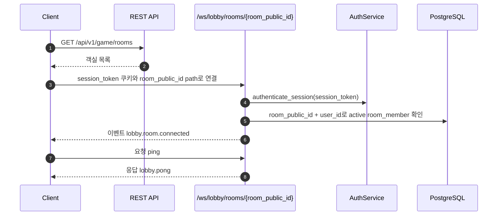
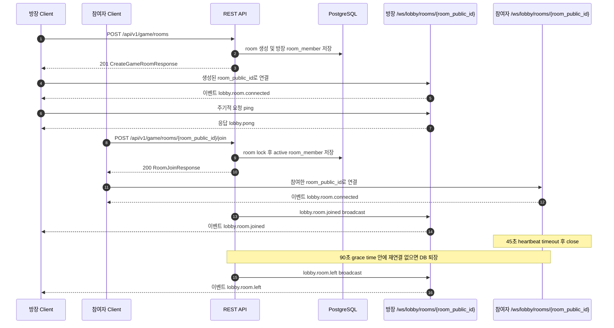
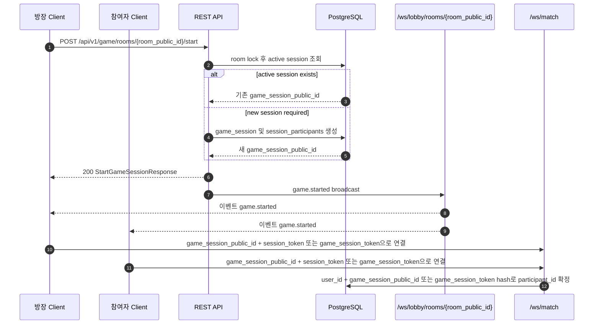
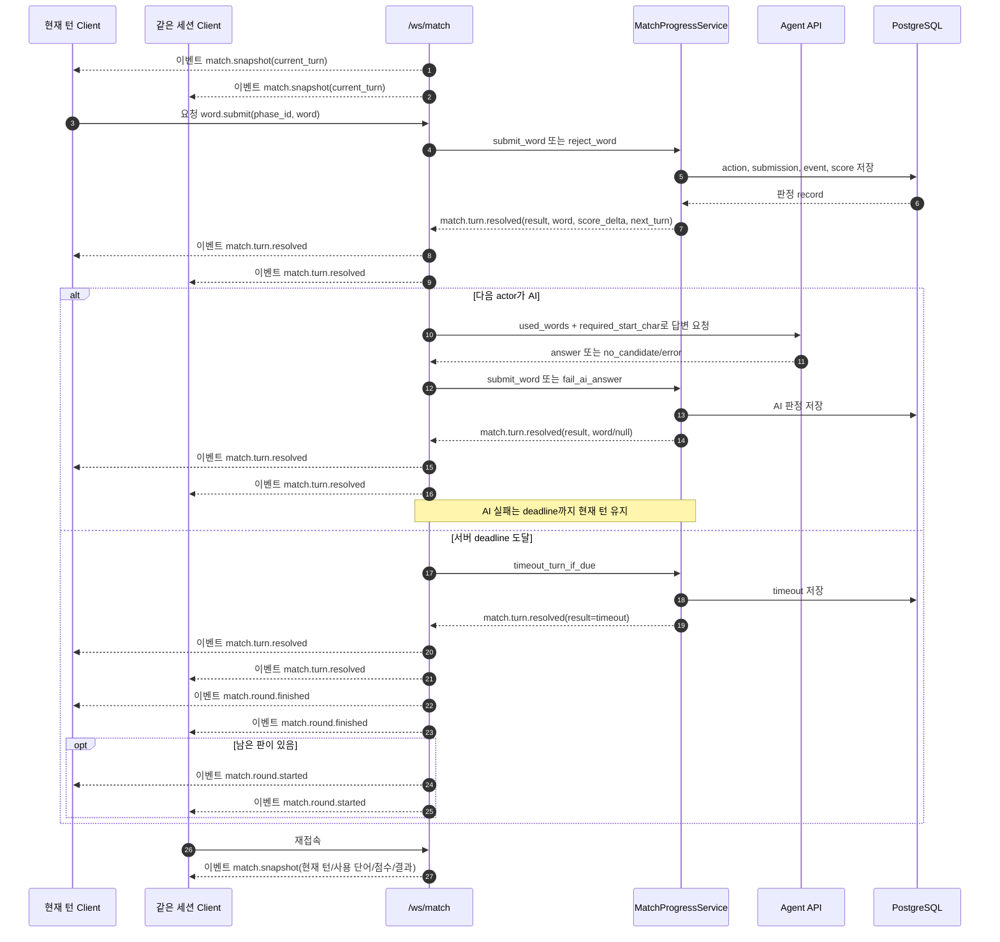

# WebSocket API

BE 서버의 WebSocket 명세 문서입니다. HTTP API 계약은 Swagger와 `docs/api.md`에서 관리하고,
이 문서는 WebSocket 연결 방식, 메시지 방향, 요청/응답/이벤트 payload를 구분해 설명합니다.

## 개요

| 엔드포인트 | 상태 | 인증 | 용도 |
| --- | --- | --- | --- |
| `/ws/lobby/rooms/{room_public_id}` | 사용 중 | `session_token` 쿠키, 활성 room member | 특정 객실 로비 연결, 객실 이벤트 수신 |
| `/ws/realtime` | 사용 중 | 없음 | 연결 테스트용 ping/pong |
| `/ws/match` | 사용 중 | `session_token` + `game_session_public_id` 또는 `game_session_token`으로 참가자 identity 고정 | 게임 진행, snapshot, 단어 제출, timeout, 투표, 결과 이벤트 |

로비의 객실 목록 조회, 객실 생성, 객실 참여, 명시적 객실 퇴장은 REST API가 담당합니다. WebSocket은
이미 참여가 허용된 객실의 실시간 이벤트를 받기 위해 연결합니다. 영속 상태는 DB가 소유하고,
WebSocket manager는 현재 열린 연결, 유저 identity, 객실별 연결 registry 같은 process-local 상태만
보관합니다.

## 공통 메시지 규칙

모든 text frame은 JSON object envelope입니다.

| 필드 | 타입 | 필수 | 설명 |
| --- | --- | --- | --- |
| `type` | string | 예 | 메시지 종류 |
| `payload` | object | 예 | 메시지 본문 |

클라이언트 요청 예시:

```json
{
  "type": "ping",
  "payload": {
    "client_time": "2026-06-12T00:00:00+09:00"
  }
}
```

서버 응답 예시:

```json
{
  "type": "lobby.pong",
  "payload": {
    "client_time": "2026-06-12T00:00:00+09:00"
  }
}
```

## 메시지 방향

| 구분 | 방향 | 의미 |
| --- | --- | --- |
| 요청(Request) | Client -> Server | 클라이언트가 서버에 보내는 command 또는 query |
| 응답(Response) | Server -> Client | 특정 요청에 대한 즉시 응답 |
| 이벤트(Event) | Server -> Client | 연결, REST API, 게임 상태 변경으로 발생하는 push |
| 오류(Error) | Server -> Client, then close | 계약 위반 또는 인증/권한 실패에 대한 오류 |

## 로비 WebSocket

### 연결

| 환경 | URL |
| --- | --- |
| 운영 | `wss://<host>/ws/lobby/rooms/{room_public_id}` |
| 로컬 | `ws://127.0.0.1:8000/ws/lobby/rooms/{room_public_id}` |

브라우저 WebSocket handshake에 포함된 HttpOnly `session_token` 쿠키로 연결 시점에 로그인 세션을
확인합니다. 그 다음 path의 `room_public_id`로 객실을 조회하고, 현재 유저가 활성 `room_members`에
포함되어 있는지 확인합니다. 세션 인증 실패, 객실 없음, 객실 멤버 아님은 모두 `1008` close code로
닫습니다.

클라이언트는 먼저 REST API로 객실 목록을 조회하거나 객실을 생성/참여한 뒤, 허용된
`room_public_id`로 이 WebSocket path에 연결합니다. 별도 `subscribe_room` 메시지는 사용하지 않습니다.

클라이언트는 연결 유지 확인을 위해 주기적으로 `ping`을 보내야 합니다. 서버는 마지막 메시지 이후
45초 동안 새 메시지를 받지 못하면 WebSocket을 `1001` close code로 닫습니다. 연결이 닫혀도 즉시
DB 퇴장 처리하지 않고, 90초 grace time 안에 같은 유저가 같은 방으로 재연결하면 퇴장을 취소합니다.
grace time이 지나도 복귀하지 않으면 `room_members.left_at`을 기록하고 같은 방 연결에
`lobby.room.left` 이벤트를 보냅니다.

### 이벤트(Event): `lobby.room.connected`

방향: Server -> 연결된 client

발생 시점: `/ws/lobby/rooms/{room_public_id}` 연결과 room member 검증 성공

Payload:

| 필드 | 타입 | 설명 |
| --- | --- | --- |
| `room_public_id` | uuid | 연결이 허용된 객실 public ID |
| `user.public_id` | uuid | 외부 노출 유저 ID |
| `user.account_id` | string | 로그인 계정 ID |
| `user.nickname` | string | 현재 닉네임 |

예시:

```json
{
  "type": "lobby.room.connected",
  "payload": {
    "room_public_id": "018fd0c5-6e1a-7c8e-9b1d-4f99e4a20b7e",
    "user": {
      "public_id": "018fd0c5-6e1a-7c8e-9b1d-4f99e4a20b7f",
      "account_id": "player_001",
      "nickname": "초보자"
    }
  }
}
```

### 이벤트(Event): `lobby.room.snapshot`

방향: Server -> 연결된 client

발생 시점: `lobby.room.connected` 전송 직후

목적: 방 화면 진입 또는 재접속 시 객실 설정과 현재 활성 멤버 리스트를 초기화합니다. 클라이언트는
별도 REST fetch 없이 이 snapshot만으로 대기방 화면을 복구하고, 이후 변경분은 `lobby.room.joined`,
`lobby.room.left`, `lobby.room.updated` 이벤트로 반영합니다.

Payload:

| 필드 | 타입 | 설명 |
| --- | --- | --- |
| `room_public_id` | uuid | snapshot 대상 객실 public ID |
| `name` | string | 객실 이름 |
| `game_type` | string | 게임 종류 |
| `status` | string | 객실 상태 |
| `max_players` | number | AI를 제외한 실제 유저 최대 인원 |
| `member_count` | number | 현재 활성 room member 수 |
| `rule_config.max_rounds` | number | 끝말잇기 판 수 |
| `rule_config.turn_time_seconds` | number | 기본 턴 제한 시간 |
| `owner_user_public_id` | uuid 또는 null | 현재 방장 public ID |
| `members` | array | 활성 room member 목록. `joined_at` 오름차순 |
| `members[].user_public_id` | uuid | 멤버 유저 public ID |
| `members[].nickname` | string | 멤버 닉네임 |
| `members[].is_owner` | boolean | 현재 방장 여부 |
| `members[].joined_at` | datetime | 객실 멤버십 생성 시각 |

예시:

```json
{
  "type": "lobby.room.snapshot",
  "payload": {
    "room_public_id": "018fd0c5-6e1a-7c8e-9b1d-4f99e4a20b7e",
    "name": "첫 객실",
    "game_type": "word_chain",
    "status": "waiting",
    "max_players": 4,
    "member_count": 2,
    "rule_config": {
      "max_rounds": 8,
      "turn_time_seconds": 10
    },
    "owner_user_public_id": "018fd0c5-6e1a-7c8e-9b1d-4f99e4a20b7f",
    "members": [
      {
        "user_public_id": "018fd0c5-6e1a-7c8e-9b1d-4f99e4a20b7f",
        "nickname": "초보자",
        "is_owner": true,
        "joined_at": "2026-06-12T00:00:00+09:00"
      },
      {
        "user_public_id": "018fd0c5-6e1a-7c8e-9b1d-4f99e4a20b80",
        "nickname": "손님",
        "is_owner": false,
        "joined_at": "2026-06-12T00:01:00+09:00"
      }
    ]
  }
}
```

### 요청(Request): `ping`

방향: Client -> Server

목적: 연결과 message round-trip 확인

Payload:

| 필드 | 타입 | 설명 |
| --- | --- | --- |
| any | any | 서버가 그대로 echo할 object payload |

예시:

```json
{
  "type": "ping",
  "payload": {
    "client_time": "2026-06-12T00:00:00+09:00"
  }
}
```

### 응답(Response): `lobby.pong`

방향: Server -> 요청 client

대응 요청: `ping`

예시:

```json
{
  "type": "lobby.pong",
  "payload": {
    "client_time": "2026-06-12T00:00:00+09:00"
  }
}
```

### 이벤트(Event): `lobby.room.joined`

방향: Server -> 같은 객실에 연결된 client

발생 시점: `POST /api/v1/game/rooms/{room_public_id}/join` 성공 중 신규 멤버가 추가된 경우
(`already_member=false`)

Payload:

| 필드 | 타입 | 설명 |
| --- | --- | --- |
| `room_public_id` | uuid | 참여한 객실 public ID |
| `user_public_id` | uuid | 참여한 유저 public ID |
| `nickname` | string | 참여 유저 닉네임 |
| `joined_at` | datetime | 객실 멤버십 생성 시각 |
| `already_member` | boolean | 이 event에서는 항상 `false` |

예시:

```json
{
  "type": "lobby.room.joined",
  "payload": {
    "room_public_id": "018fd0c5-6e1a-7c8e-9b1d-4f99e4a20b7e",
    "user_public_id": "018fd0c5-6e1a-7c8e-9b1d-4f99e4a20b7f",
    "nickname": "초보자",
    "joined_at": "2026-06-12T00:00:00+09:00",
    "already_member": false
  }
}
```

### 이벤트(Event): `lobby.room.left`

방향: Server -> 같은 방에 연결된 client

발생 시점: `POST /api/v1/game/rooms/{room_public_id}/leave` 성공 또는 WebSocket 연결 종료 후 grace
time 안에 같은 유저가 같은 방으로 재연결하지 않음

Payload:

| 필드 | 타입 | 설명 |
| --- | --- | --- |
| `room_public_id` | uuid | 퇴장 처리된 방 public ID |
| `user_public_id` | uuid | 퇴장 처리된 유저 public ID |
| `nickname` | string | 퇴장 처리된 유저 닉네임 |
| `left_at` | datetime | DB에 기록된 퇴장 시각 |
| `remaining_member_count` | number | 퇴장 후 남은 활성 멤버 수 |
| `new_owner_user_public_id` | uuid 또는 null | 방장이 승계된 경우 새 방장 public ID |
| `new_owner_nickname` | string 또는 null | 방장이 승계된 경우 새 방장 닉네임 |
| `room_closed` | boolean | 마지막 멤버 퇴장으로 room이 닫혔는지 여부 |

예시:

```json
{
  "type": "lobby.room.left",
  "payload": {
    "room_public_id": "018fd0c5-6e1a-7c8e-9b1d-4f99e4a20b7e",
    "user_public_id": "018fd0c5-6e1a-7c8e-9b1d-4f99e4a20b7f",
    "nickname": "초보자",
    "left_at": "2026-06-12T00:00:00+09:00",
    "remaining_member_count": 1,
    "new_owner_user_public_id": "018fd0c5-6e1a-7c8e-9b1d-4f99e4a20b80",
    "new_owner_nickname": "다음방장",
    "room_closed": false
  }
}
```

### 이벤트(Event): `game.started`

방향: Server -> 같은 객실에 연결된 client

발생 시점: `POST /api/v1/game/rooms/{room_public_id}/start` 성공

REST start API가 세션 생성을 확정한 뒤 로비에서 매치로 넘어가는 handoff용으로 broadcast합니다.
방 전체 공통 payload에는 사용자별 `game_session_token`을 포함하지 않습니다.
끝말잇기 세션은 시작 transaction 안에서 첫 번째 턴을 함께 생성하며, 첫 턴 `started_at`은 시작 확정
시각보다 5초 뒤로 잡습니다. `game.started.current_turn`에는 이 첫 차례 정보를 포함합니다.
첫 턴 `required_start_char`는 `word_game.valid_words`의 활성 단어가 실제로 가진 `starts_with` 중
하나를 무작위로 선택하며, 후보 단어셋이 비어 있을 때만 `null`입니다.
`/ws/match` 연결 직후에도 `match.snapshot.current_turn`으로 같은 정보를 복구할 수 있습니다.

Payload:

| 필드 | 타입 | 설명 |
| --- | --- | --- |
| `room_public_id` | uuid | 시작된 객실 public ID |
| `game_session_public_id` | uuid | match 연결에 사용할 게임 세션 public ID |
| `game_type` | string | 게임 종류 |
| `status` | string | 시작된 게임 세션 상태 |
| `rule_config` | object | 시작 시점에 세션으로 고정된 룰 설정 |
| `server_time` | datetime | 이 handoff를 만든 서버 기준 현재 시각 |
| `current_turn` | object/null | 시작 직후 첫 턴 정보 |
| `current_turn.phase_id` | uuid | `word.submit.phase_id`에 사용할 현재 턴 phase ID |
| `current_turn.round_number` | number | 현재 끝말잇기 판 번호. 시작 직후는 1 |
| `current_turn.turn_number` | number | 현재 판 안의 턴 번호. 시작 직후는 1 |
| `current_turn.actor_seat_number` | number | 첫 차례 참가자의 순서 |
| `current_turn.started_at` | datetime | 첫 턴이 실제로 시작되는 서버 기준 시각. 시작 확정 후 5초 뒤 |
| `current_turn.deadline_at` | datetime/null | 서버 기준 턴 제한 시각 |
| `current_turn.required_start_char` | string/null | 첫 턴에 필요한 시작 글자. 활성 유효 단어셋의 시작 글자 중 무작위 선택 |
| `participants` | array | 시작 시 고정된 익명 참가자 snapshot |
| `participants[].display_name` | string | `1번 손님` 같은 익명 표시명 |
| `participants[].seat_number` | number | 게임 세션 안 순서 |

`game.started` payload에는 `game_session_token`, `participant_type`, `is_uninvited_guest`, 원래 닉네임을
넣지 않습니다.

### 이벤트(Event): `lobby.room.updated`

방향: Server -> 같은 객실에 연결된 client

발생 시점: `PATCH /api/v1/game/rooms/{room_public_id}` 성공

Payload:

| 필드 | 타입 | 설명 |
| --- | --- | --- |
| `room_public_id` | uuid | 수정된 객실 public ID |
| `name` | string | 객실 이름 |
| `game_type` | string | 게임 종류 |
| `status` | string | 객실 상태 |
| `max_players` | number | AI를 제외한 실제 유저 최대 인원 |
| `rule_config.max_rounds` | number | 끝말잇기 판 수 |
| `rule_config.turn_time_seconds` | number | 기본 턴 제한 시간 |

## Match WebSocket

### 연결

| 환경 | URL |
| --- | --- |
| 운영 | `wss://<host>/ws/match?game_session_public_id={game_session_public_id}` |
| 로컬 | `ws://127.0.0.1:8000/ws/match?game_session_public_id={game_session_public_id}` |
| 재접속 | `ws://127.0.0.1:8000/ws/match?game_session_token={game_session_token}` |

`session_token` 쿠키와 `game_session_public_id` 조합으로 참가자를 확인하거나, 재접속용
`game_session_token`으로 participant identity를 복원합니다. 연결이 수락되면 서버는 `match.connected`,
`match.snapshot` 순서로 현재 상태를 보냅니다.

### 이벤트(Event): `match.connected`

방향: Server -> 연결 client

Payload:

| 필드 | 타입 | 설명 |
| --- | --- | --- |
| `game_session_public_id` | uuid | 연결된 게임 세션 public ID |
| `participant.display_name` | string | 현재 참가자의 익명 표시명 |
| `participant.seat_number` | number | 현재 참가자의 순서 |

### 이벤트(Event): `match.snapshot`

방향: Server -> 연결 client

재접속과 화면 복구에 필요한 익명 match 상태입니다. 참가자는 `display_name`, `seat_number`, `is_me`로만
노출하고, 실제 닉네임, 유저 ID, AI 여부는 포함하지 않습니다.

Payload 주요 필드:

| 필드 | 타입 | 설명 |
| --- | --- | --- |
| `game_session_public_id` | uuid | 게임 세션 public ID |
| `status` | string | 게임 세션 상태 |
| `rule_config` | object | 시작 시점에 고정된 룰 설정 |
| `participants` | array | 익명 참가자 목록 |
| `current_round_number` | number/null | 현재 끝말잇기 판 번호 |
| `current_turn` | object/null | 현재 턴 정보 |
| `current_turn.phase_id` | uuid | `word.submit.phase_id`에 사용할 현재 턴 phase ID |
| `current_turn.round_number` | number | 현재 끝말잇기 판 번호 |
| `current_turn.turn_number` | number | 현재 판 안의 턴 번호 |
| `current_turn.actor_seat_number` | number | 현재 차례 참가자의 순서 |
| `current_turn.started_at` | datetime | 현재 턴이 실제로 시작되는 서버 기준 시각 |
| `current_turn.deadline_at` | datetime/null | 서버 기준 턴 제한 시각 |
| `current_turn.required_start_char` | string/null | 이번 턴에 필요한 시작 글자. 라운드 첫 턴은 활성 유효 단어셋의 시작 글자 중 무작위 선택 |
| `used_words` | array | 현재 끝말잇기 판에서 이미 사용된 정규화 단어 |
| `scoreboard` | array | 익명 점수판 |
| `server_time` | datetime | 서버 기준 현재 시각 |
| `voting_deadline_at` | datetime/null | `voting` 상태에서 서버가 결과를 강제 확정할 시각 |
| `results` | array | `result` 상태에서 재접속 화면 복구에 사용할 최종 결과 목록. 진행 중에는 빈 배열 |
| `results[].participant.display_name` | string | 결과 참가자의 익명 표시명 |
| `results[].participant.seat_number` | number | 결과 참가자의 순서 |
| `results[].participant.revealed_participant_type` | string | 결과 상태에서 공개되는 `user` 또는 `ai` |
| `results[].final_score` | number | 최종 점수 |
| `results[].rank` | number | 동점 공동 등수를 반영한 순위 |
| `results[].is_winner` | boolean | 최종 공동/단독 우승 여부 |
| `results[].vote_score_delta` | number | 투표로 발생한 점수 변화 |
| `results[].score_breakdown.word_score` | number | 단어 제출 성공 등 단어 게임에서 발생한 점수 합계 |
| `results[].score_breakdown.vote_score` | number | AI 지목 투표에서 발생한 점수 합계 |
| `results[].score_breakdown.penalty_score` | number | 단어 게임/투표 외 penalty성 점수 합계 |
| `results[].score_breakdown.items[]` | array | `score_ledger` 사유별 점수 변화 목록 |
| `results[].score_breakdown.items[].reason` | string | 점수 변화 사유. 예: `word_accepted`, `vote_correct`, `vote_wrong`, `voted_as_ai` |
| `results[].score_breakdown.items[].score_delta` | number | 해당 사유로 발생한 점수 변화 |
| `results[].is_me` | boolean | 현재 연결 참가자 여부 |

### 요청(Request): `ping`

방향: Client -> Server

서버는 client payload에 `server_time`을 더해 `match.pong`으로 반환합니다. 클라이언트는 이 값을
`match.snapshot.server_time`과 함께 서버-클라이언트 시계 offset 보정에 사용할 수 있습니다.
지원하지 않는 message type은 `error` envelope를 보낸 뒤 `1008` close code로 연결을 닫습니다.

### 요청(Request): `word.submit`

방향: Client -> Server

현재 턴 참가자가 단어를 제출합니다. 서버는 연결 identity의 `participant_id`, payload의 `phase_id`, 서버 시각,
DB의 현재 phase/turn/deadline과 현재 라운드의 `used_words`를 기준으로 제출을 검증합니다.

Payload:

| 필드 | 타입 | 설명 |
| --- | --- | --- |
| `phase_id` | uuid | 클라이언트가 보고 있는 현재 턴 phase ID |
| `word` | string | 제출 단어 |

예시:

```json
{
  "type": "word.submit",
  "payload": {
    "phase_id": "018fd0c5-6e1a-7c8e-9b1d-4f99e4a20b90",
    "word": "사과"
  }
}
```

### 이벤트(Event): `match.turn.resolved`

방향: Server -> 같은 게임 세션에 연결된 client

발생 시점: 현재 턴이 제출, 거절, timeout, AI 실패 중 하나로 판정된 뒤.
사용자와 AI의 단어 제출은 정답/오답 여부와 무관하게 같은 게임 세션에 연결된 모든 client에게 공개합니다.
클라이언트는 `payload.result`로 판정 상태를 구분하고, `payload.word`와 `payload.normalized_word`로 실제 제출
내용을 표시합니다. timeout과 AI 실패처럼 제출 단어가 없는 판정은 `word`, `normalized_word`가 `null`입니다.

`payload.result` 값:

| 값 | 의미 |
| --- | --- |
| `accepted` | 제출 단어가 현재 턴, 제한 시간, 시작 글자, 사전 등재, 중복 단어 검증을 통과했고 다음 턴이 생성됨 |
| `rejected` | 제출 단어가 시작 글자 불일치, 사전 미등재, 중복 단어 같은 게임 규칙 검증에 실패함 |
| `timeout` | 서버 기준 `current_turn.deadline_at`이 지나 현재 턴이 시간 초과로 확정됨 |
| `failed` | 손님 답변을 확정하지 못함. 내부 Agent/API 실패 사유는 공개하지 않음 |

다음 턴 actor가 AI인 경우 Backend는 현재 phase, 사용된 단어 목록, 시작 글자를 Agent answer API에 넘겨
AI 답변을 받아 같은 제출 확정 경로로 처리할 수 있습니다. Agent answer 설정이 활성화되어 있으면
사용자 `accepted` 이벤트 이후 AI 턴의 `accepted`, `rejected`, `timeout`, `failed` 판정이 같은 WebSocket
연결에 이어서 broadcast됩니다.

서버는 게임 규칙상 거절도 WebSocket 연결 오류로 처리하지 않습니다. `participant_actions`, `score_ledger`,
`game_events`에 판정 기록을 저장하고 transaction commit 이후 `match.turn.resolved`를 broadcast합니다.
거절된 경우 현재 턴은 유지되며 `next_turn`은 생성하지 않습니다. 사전에 없는 단어는
`reason="word_not_in_dictionary"`로 거절합니다.

답변 실패도 즉시 다음 턴이나 투표로 넘기지 않습니다. 서버는 실패 action/event를 저장하고
`result="failed"`를 broadcast하지만, 현재 phase는 deadline까지 유지합니다. 공개 payload의 `reason`은
`answer_unavailable`로 통일하고, Agent/API 같은 내부 실패 사유는 `reason`이나 `details`에 노출하지
않습니다. AI가 단어를 반환했지만 Backend 검증에 실패한 경우 `word`, `normalized_word`에는 제출 단어를
담습니다. 실제 턴 종료와 다음 판/투표 전환은 서버 deadline에 도달해 `timeout`이 확정될 때만 일어납니다.

서버 timeout 판단은 클라이언트 타이머가 아니라 서버 시각과 DB의 phase deadline을 기준으로 합니다.
`/ws/match` 서버 루프는 heartbeat 대기 시간과 현재 턴 deadline 중 더 이른 시점까지만 client frame을
기다리고, deadline이 먼저 도달하면 `turn_timeout` 확정을 시도합니다. deadline 이후 도착한 `word.submit`도
연결 오류로 닫지 않고 같은 timeout 확정 경로로 처리합니다.

timeout으로 현재 끝말잇기 한판이 종료되면 payload에는 종료된 `round_number`, 다음 판 정보인
`next_turn` 또는 투표 전환을 뜻하는 `next_status="voting"`과 `voting_deadline_at`이 포함될 수 있습니다.
이 경우 서버는 같은 내용을 사용자 화면에서 더 명확히 처리할 수 있도록 `match.round.finished`도 이어서
broadcast합니다. 남은 판이 있어 `next_turn`이 생성되면 다음 라운드 첫 턴의 `started_at`을 timeout 확정
시각보다 5초 뒤로 잡고, `match.round.started`도 그 시작 시각에 맞춰 보내 다음 라운드 첫 턴을 명확히
알립니다. 다음 라운드 첫 턴의 `required_start_char`도 활성 유효 단어셋의 시작 글자 중 무작위로
선택합니다.

Payload:

| 필드 | 타입 | 설명 |
| --- | --- | --- |
| `event_sequence` | number | 세션 안 event 순서 |
| `phase_id` | uuid | 판정이 확정된 phase ID |
| `participant.display_name` | string | 판정 대상 참가자의 익명 표시명 |
| `participant.seat_number` | number | 판정 대상 참가자의 순서 |
| `round_number` | number/null | timeout으로 종료된 끝말잇기 판 번호 |
| `result` | string | `accepted`, `rejected`, `timeout`, `failed` 중 하나 |
| `word` | string/null | 제출 단어. 제출이 없는 timeout/Agent 미응답 실패는 `null` |
| `normalized_word` | string/null | 중복 방지에 사용하는 정규화 단어. 제출이 없으면 `null` |
| `reason` | string/null | 거절, timeout, 실패 사유. accepted는 `null`, 내부 답변 실패는 `answer_unavailable` |
| `details` | object | 필요한 시작 글자, timeout 초 등 비식별 세부 정보. Agent/API 내부 정보는 포함하지 않음 |
| `score_delta` | number | 판정으로 발생한 점수 변화. 점수 변화가 없으면 0 |
| `deadline_at` | datetime/null | timeout일 때 서버가 확정한 제한 시각 |
| `next_turn` | object 또는 null | 남은 판이 있을 때 새로 생성된 다음 판 첫 턴 정보 |
| `next_turn.phase_id` | uuid | 새로 생성된 다음 턴 phase ID |
| `next_turn.round_number` | number | 다음 턴의 끝말잇기 판 번호 |
| `next_turn.turn_number` | number | 다음 턴 번호 |
| `next_turn.actor_seat_number` | number | 다음 차례 참가자의 순서 |
| `next_turn.started_at` | datetime | 다음 턴이 실제로 시작되는 서버 기준 시각. 다음 라운드 첫 턴은 라운드 종료 확정 후 5초 뒤 |
| `next_turn.deadline_at` | datetime | 다음 턴의 서버 기준 제한 시각 |
| `next_turn.required_start_char` | string/null | 다음 단어가 시작해야 하는 글자 |
| `next_status` | string 또는 null | 모든 판이 끝난 경우 다음 세션 상태. 현재는 `voting` |
| `voting_deadline_at` | datetime/null | 투표가 강제 종료될 서버 기준 시각 |
| `created_at` | datetime | 서버가 판정을 확정한 시각 |
| `server_time` | datetime | 이 이벤트를 만든 서버 기준 현재 시각. 보통 `created_at`과 같습니다 |

### 이벤트(Event): `match.round.finished`

방향: Server -> 같은 게임 세션에 연결된 client

발생 시점: 서버 기준 timeout으로 현재 끝말잇기 한판이 종료되고, 다음 판 첫 턴 또는 최종 투표 phase가
생성된 직후. 기존 호환을 위해 `match.turn.resolved(result="timeout")`를 먼저 보내고, 그 다음 이 이벤트를
연달아 보냅니다.

클라이언트는 이 이벤트를 사용해 "라운드 종료", "다음 라운드 시작", "투표 진입" 같은 큰 화면 전환을
분명히 표시할 수 있습니다.

Payload:

| 필드 | 타입 | 설명 |
| --- | --- | --- |
| `event_sequence` | number/null | 원인이 된 timeout event 순서 |
| `phase_id` | uuid | 종료된 turn phase ID |
| `round_number` | number | 종료된 끝말잇기 판 번호 |
| `result` | string | 현재는 `timeout` |
| `reason` | string | 현재는 `deadline_exceeded` |
| `participant.display_name` | string | timeout 대상 참가자의 익명 표시명 |
| `participant.seat_number` | number | timeout 대상 참가자의 순서 |
| `deadline_at` | datetime | 종료된 턴의 서버 기준 제한 시각 |
| `next_turn` | object 또는 null | 남은 판이 있을 때 새로 생성된 다음 판 첫 턴 정보 |
| `next_status` | string 또는 null | 모든 판이 끝난 경우 다음 세션 상태. 현재는 `voting` |
| `voting_deadline_at` | datetime/null | 투표가 강제 종료될 서버 기준 시각 |
| `created_at` | datetime | 서버가 라운드 종료를 확정한 시각 |
| `server_time` | datetime | 이 이벤트를 만든 서버 기준 현재 시각 |

### 이벤트(Event): `match.round.started`

방향: Server -> 같은 게임 세션에 연결된 client

발생 시점: `match.round.finished` 이후 남은 판이 있어 다음 라운드 첫 턴이 생성되고, 5초 대기 시간이 지난
시점. 투표로 넘어가는 마지막 라운드 종료에서는 발생하지 않습니다.

Payload:

| 필드 | 타입 | 설명 |
| --- | --- | --- |
| `event_sequence` | number/null | 원인이 된 timeout event 순서 |
| `round_number` | number | 시작된 끝말잇기 판 번호 |
| `current_turn` | object | 새 라운드의 첫 턴 정보 |
| `current_turn.phase_id` | uuid | 새 턴 phase ID |
| `current_turn.turn_number` | number | 새 라운드 안의 턴 번호. 첫 턴은 1 |
| `current_turn.actor_seat_number` | number | 첫 차례 참가자의 순서 |
| `current_turn.started_at` | datetime | 첫 턴이 실제로 시작되는 서버 기준 시각 |
| `current_turn.deadline_at` | datetime | 첫 턴의 서버 기준 제한 시각 |
| `current_turn.required_start_char` | string/null | 첫 턴의 시작 글자. 활성 유효 단어셋의 시작 글자 중 무작위 선택 |
| `started_at` | datetime/null | 라운드 시작 시각 |
| `created_at` | datetime/null | 서버가 이벤트를 만든 시각 |
| `server_time` | datetime | 라운드 시작 이벤트를 보낸 서버 기준 현재 시각 |

### 요청(Request): `vote.submit`

방향: Client -> Server

`voting` 상태에서 실제 유저 참가자가 AI로 의심되는 손님을 지목합니다. 익명성을 유지하기 위해
클라이언트는 참가자 UUID가 아니라 공개된 순서 번호인 `target_seat_number`만 보냅니다.

Payload:

| 필드 | 타입 | 설명 |
| --- | --- | --- |
| `target_seat_number` | number | AI로 지목할 참가자의 공개 순서 |

### 이벤트(Event): `match.vote.accepted`

방향: Server -> 같은 게임 세션에 연결된 client

발생 시점: 서버가 투표 제출을 저장한 뒤. 다른 참가자의 선택을 누설하지 않도록 target은 broadcast하지 않고,
투표자와 제출 현황만 공유합니다.

Payload:

| 필드 | 타입 | 설명 |
| --- | --- | --- |
| `event_sequence` | number | 세션 안 event 순서 |
| `voter.display_name` | string | 투표를 제출한 참가자의 익명 표시명 |
| `voter.seat_number` | number | 투표를 제출한 참가자의 순서 |
| `submitted_vote_count` | number | 제출된 실제 유저 투표 수 |
| `required_vote_count` | number | 결과 확정에 필요한 실제 유저 투표 수 |
| `created_at` | datetime | 서버가 투표를 확정한 시각 |
| `server_time` | datetime | 이 이벤트를 만든 서버 기준 현재 시각 |

### 이벤트(Event): `match.vote.timeout`

방향: Server -> 같은 게임 세션에 연결된 client

발생 시점: `voting_deadline_at`이 지났는데 모든 실제 유저 투표가 제출되지 않은 경우. 서버는 제출된
투표만 점수에 반영하고 미투표자는 투표 점수 0점으로 남긴 뒤 결과를 확정합니다.
deadline 이후 도착한 `vote.submit`도 연결 오류로 닫지 않고 같은 timeout 확정 경로로 처리합니다.

Payload:

| 필드 | 타입 | 설명 |
| --- | --- | --- |
| `event_sequence` | number | 세션 안 event 순서 |
| `submitted_vote_count` | number | deadline까지 제출된 실제 유저 투표 수 |
| `required_vote_count` | number | 결과 확정에 필요했던 실제 유저 투표 수 |
| `created_at` | datetime | 서버가 투표 timeout을 확정한 시각 |
| `server_time` | datetime | 이 이벤트를 만든 서버 기준 현재 시각 |

### 이벤트(Event): `match.result.published`

방향: Server -> 같은 게임 세션에 연결된 client

발생 시점: 모든 실제 유저 투표가 제출되었거나 투표 deadline이 지나 서버가 최종 점수와 순위를 저장한 뒤.
이 이벤트에서 참가자의 `revealed_participant_type`이 공개됩니다.

Payload:

| 필드 | 타입 | 설명 |
| --- | --- | --- |
| `event_sequence` | number | 세션 안 event 순서 |
| `results[].participant.display_name` | string | 익명 표시명 |
| `results[].participant.seat_number` | number | 참가자 순서 |
| `results[].participant.revealed_participant_type` | string | `user` 또는 `ai` |
| `results[].final_score` | number | 단어 점수와 투표 점수를 합산한 최종 점수 |
| `results[].rank` | number | 동점 공동 등수를 반영한 순위 |
| `results[].is_winner` | boolean | 최종 공동/단독 우승 여부 |
| `results[].vote_score_delta` | number | 투표로 발생한 점수 변화 |
| `results[].score_breakdown.word_score` | number | 단어 제출 성공 등 단어 게임에서 발생한 점수 합계 |
| `results[].score_breakdown.vote_score` | number | AI 지목 투표에서 발생한 점수 합계 |
| `results[].score_breakdown.penalty_score` | number | 단어 게임/투표 외 penalty성 점수 합계 |
| `results[].score_breakdown.items[]` | array | `score_ledger` 사유별 점수 변화 목록 |
| `results[].score_breakdown.items[].reason` | string | 점수 변화 사유. 예: `word_accepted`, `vote_correct`, `vote_wrong`, `voted_as_ai` |
| `results[].score_breakdown.items[].score_delta` | number | 해당 사유로 발생한 점수 변화 |
| `created_at` | datetime | 서버가 결과를 확정한 시각 |
| `server_time` | datetime | 이 이벤트를 만든 서버 기준 현재 시각 |

예시:

```json
{
  "type": "match.result.published",
  "payload": {
    "event_sequence": 8,
    "results": [
      {
        "participant": {
          "display_name": "1번 손님",
          "seat_number": 1,
          "revealed_participant_type": "user"
        },
        "final_score": 20,
        "rank": 1,
        "is_winner": true,
        "vote_score_delta": 10,
        "score_breakdown": {
          "word_score": 10,
          "vote_score": 10,
          "penalty_score": 0,
          "items": [
            {"reason": "word_accepted", "score_delta": 10},
            {"reason": "vote_correct", "score_delta": 10}
          ]
        }
      },
      {
        "participant": {
          "display_name": "2번 손님",
          "seat_number": 2,
          "revealed_participant_type": "ai"
        },
        "final_score": -5,
        "rank": 2,
        "is_winner": false,
        "vote_score_delta": -5,
        "score_breakdown": {
          "word_score": 0,
          "vote_score": -5,
          "penalty_score": 0,
          "items": [
            {"reason": "voted_as_ai", "score_delta": -5}
          ]
        }
      }
    ],
    "created_at": "2026-06-19T13:15:53+09:00",
    "server_time": "2026-06-19T13:15:53+09:00"
  }
}
```

## Realtime WebSocket

`/ws/realtime`은 연결 테스트용 ping/pong 채널입니다. 게임 상태를 소유하거나 broadcast하지 않습니다.

| 환경 | URL |
| --- | --- |
| 운영 | `wss://<host>/ws/realtime` |
| 로컬 | `ws://127.0.0.1:8000/ws/realtime` |

### 요청(Request): `ping`

방향: Client -> Server

예시:

```json
{
  "type": "ping",
  "payload": {
    "client_time": "2026-06-11T00:00:00+09:00"
  }
}
```

### 응답(Response): `realtime.pong`

방향: Server -> 요청 client

대응 요청: `ping`

예시:

```json
{
  "type": "realtime.pong",
  "payload": {
    "client_time": "2026-06-11T00:00:00+09:00"
  }
}
```

## 사용자 흐름

아래 diagram은 한 번에 모든 흐름을 담지 않고, 문서를 읽는 목적에 맞게 작은 단위로 나눕니다.

### 로비 연결



### 객실 생성과 참여



### 게임 시작과 매치 연결



### 게임 진행과 판정 동기화



## 오류와 종료 코드

잘못된 JSON, envelope 형식 오류, 지원하지 않는 message type은 서버가 `error` envelope를 보낸 뒤
`VALIDATION_ERROR`의 WebSocket close code인 `1008`로 연결을 종료합니다.

오류 예시:

```json
{
  "type": "error",
  "payload": {
    "success": false,
    "data": null,
    "error": {
      "code": "VALIDATION_ERROR",
      "message": "요청 값이 올바르지 않습니다.",
      "details": {
        "reason": "unsupported_message_type",
        "type": "unknown"
      }
    }
  }
}
```

| 에러 코드 | 종료 코드 | 적용 endpoint | 의미 |
| --- | --- | --- | --- |
| `SESSION_EXPIRED` | `1008` | `/ws/lobby/rooms/{room_public_id}`, `/ws/match` | 연결 시점의 세션 쿠키 없음, 만료, 폐기 |
| `GAME_ROOM_NOT_FOUND` | `1008` | `/ws/lobby/rooms/{room_public_id}` | path의 객실 없음 |
| `GAME_ROOM_ENTRY_FORBIDDEN` | `1008` | `/ws/lobby/rooms/{room_public_id}` | 현재 유저가 path 객실의 활성 멤버가 아님 |
| `GAME_SESSION_ENTRY_FORBIDDEN` | `1008` | `/ws/match` | 현재 유저 또는 재접속 token이 게임 세션 참가자로 확인되지 않음 |
| `VALIDATION_ERROR` | `1008` | 전체 WebSocket | JSON, envelope, query, command payload 계약 위반 |
| `HTTP_ERROR` | `1011` | 전체 WebSocket | 서버 내부 오류 |

## 테스트 클라이언트

Hoppscotch WebSocket client에서 WebSocket 연결과 메시지 송수신을 테스트할 수 있습니다.
