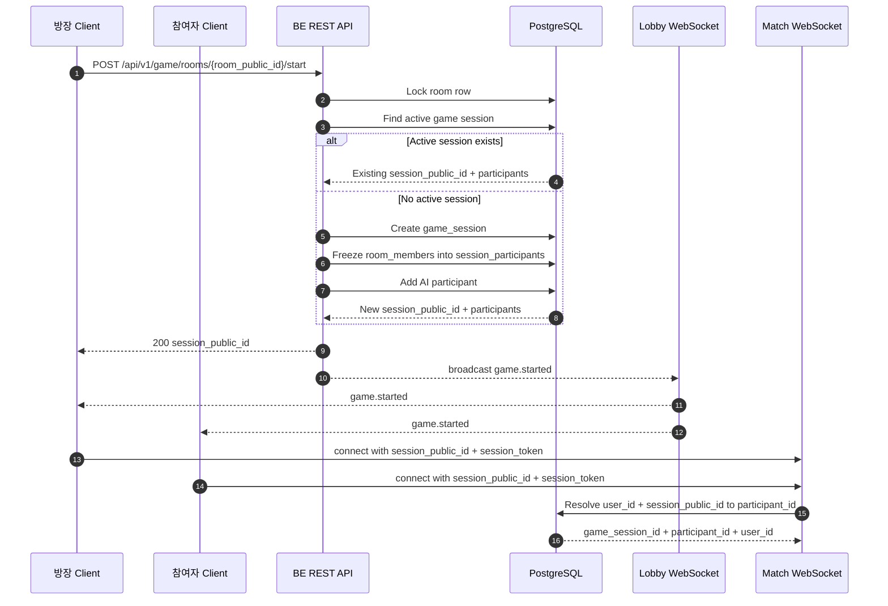

# WebSocket API

BE 서버의 WebSocket API입니다.

## Game Start User Flow

현재 구현 범위는 게임 진행 WebSocket을 열기 전 REST gate입니다. 방장이 start API를 호출하면
서버는 room row를 잠그고, 이미 active session이 있으면 기존 `session_public_id`를 반환합니다.
새 session이 필요할 때만 활성 room member를 `session_participants`로 고정하고 AI 손님을 추가합니다.

이후 `/ws/lobby`가 구현되면 start API handler는 DB commit 뒤 lobby connection manager에
`game.started` broadcast를 요청합니다. 참여자는 이벤트의 `session_public_id`로 `/ws/match`에
연결하고, 서버는 연결 시점에 `session_token`으로 user_id를 복원한 뒤
`user_id + session_public_id`로 `participant_id`를 확정합니다.



## Realtime

`/ws/realtime`은 연결 테스트용 ping/pong 채널입니다. 실제 해질녘 게임 상태는 이 endpoint에서
처리하지 않고, 게임용 WebSocket은 `/ws/lobby`, `/ws/match`로 분리합니다.

| Environment | URL |
| --- | --- |
| Production | `wss://<host>/ws/realtime` |
| Local | `ws://127.0.0.1:8000/ws/realtime` |

모든 메시지는 JSON envelope를 사용합니다.

```json
{
  "type": "ping",
  "payload": {}
}
```

### `ping`

연결과 메시지 왕복을 확인합니다. 서버는 받은 `payload`를 그대로 담아 `realtime.pong`을 반환합니다.

Client:

```json
{
  "type": "ping",
  "payload": {
    "client_time": "2026-06-11T00:00:00Z"
  }
}
```

Server:

```json
{
  "type": "realtime.pong",
  "payload": {
    "client_time": "2026-06-11T00:00:00Z"
  }
}
```

## Error

잘못된 JSON, envelope 형식 오류, 지원하지 않는 message type은 서버가 `error` envelope를 보낸 뒤
`VALIDATION_ERROR`의 WebSocket close code인 `1008`로 연결을 종료합니다.

```json
{
  "type": "error",
  "payload": {
    "success": false,
    "data": null,
    "error": {
      "code": "VALIDATION_ERROR",
      "message": "요청 값이 올바르지 않습니다.",
      "details": {
        "reason": "unsupported_message_type",
        "type": "unknown"
      }
    }
  }
}
```

## Docs Route

이 문서는 BE 서버에서 `GET /ws-docs`로 조회할 수 있습니다.

## Test Client

- [Hoppscotch WebSocket client](https://hoppscotch.io/realtime/websocket)에서 WebSocket 연결과 메시지 송수신을 테스트할 수 있습니다.
