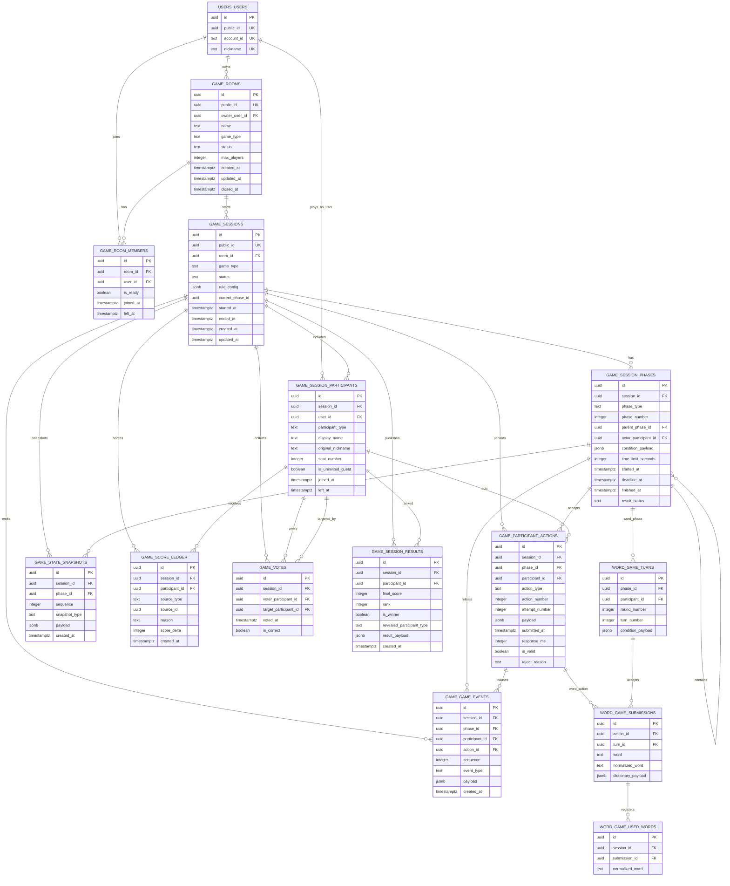

# Sunset Game Database Design

이 문서는 [sunset-game-domain.md](sunset-game-domain.md)의 도메인 개념을 DB schema 초안으로 정리한 것이다.
현재 단계의 목표는 ORM/migration 구현이 아니라, 이후 구현자가 같은 경계와 식별자 정책으로 table을 만들 수 있게
설계 기준을 남기는 것이다.

## Scope

DB는 게임의 최종 사실과 복구 가능한 기록을 저장한다.

- 저장한다: 객실, 대기방 참가자, 게임 세션, 세션 참가자, 진행 구간, 참가자 행동, 상태 snapshot, 서버 event, 점수 원장, 투표, 결과 snapshot
- 저장하지 않는다: WebSocket connection 객체, 매초 timer tick, transient countdown 표시 상태, process-local lock
- 서버 메모리와 WebSocket snapshot은 현재 진행 상태를 빠르게 제공하고, DB는 재접속, 결과 조회, 감사, 디버깅의 기준이 된다.
- 앱 시작 시 DB에서 진행 중 세션을 복구할 수는 있어야 하지만, 초 단위 타이머 재현까지 DB가 책임지지는 않는다.

## Identifier and Numbering Rules

- 모든 table의 row 내부 식별자인 `id`는 UUID v7 primary key를 사용한다.
- 외부 노출이 필요한 resource만 `public_id` UUID v7을 별도로 둔다.
- foreign key와 join은 내부 식별자인 `id` 기준으로 한다.
- 게임 안의 순서, 번호, 개수, 점수는 UUID가 아니라 integer를 사용한다.
- 예: `phase_number`, `action_number`, `round_number`, `turn_order`, `attempt_number`, `rank`, `score_delta`, `max_players`
- 정렬 또는 순서 판단에 쓰는 integer는 table 단위 unique constraint로 의미를 고정한다.

## PostgreSQL Schemas

공통 게임 플랫폼 table은 PostgreSQL schema `game`에 둔다.
특정 게임군의 세부 table은 별도 schema를 둘 수 있다. 예를 들어 단어 게임군은 `word_game` schema를 사용한다.

초기 설계에서 상태와 game type은 PostgreSQL enum보다 `text` column과 service validation으로 관리한다.
게임 규칙과 상태 이름이 아직 변할 수 있으므로 migration churn을 줄이기 위한 선택이다.

## Index Strategy

현재 Backend 조회 패턴 기준 인덱스 원칙은 다음과 같다.

- 외부 식별자 lookup인 `rooms.public_id`, `game_sessions.public_id`, `users.public_id`, 로그인 `account_id`,
  닉네임, 세션 token hash는 unique index 또는 unique constraint로 관리한다.
- `session_participants.resume_token_hash`는 match 재접속 credential이므로 null이 아닌 값만 대상으로 하는
  partial unique index를 둔다.
- 로비 목록은 닫히지 않았고 활성 멤버가 1명 이상인 방만 `created_at DESC`로 조회한다. room 쪽 조건은
  `rooms(created_at DESC) WHERE closed_at IS NULL` partial index로, 활성 멤버 집계는 아래 room member
  partial index로 뒷받침한다.
- 활성 room member 목록은 `room_id`, `left_at IS NULL`, `joined_at ASC` 패턴이므로
  `room_members(room_id, joined_at) WHERE left_at IS NULL` partial index를 둔다. 활성 멤버 단건 중복 방지는
  `room_members(room_id, user_id) WHERE left_at IS NULL` partial unique index가 담당한다.
- room의 active game session 조회는 `room_id`, `ended_at IS NULL`, non-terminal status,
  `started_at DESC LIMIT 1` 패턴이므로 `game_sessions(room_id, started_at DESC)` partial index를 둔다.
- 점수판과 결과 집계는 `score_ledger.session_id`로 모아 `participant_id`별 합산하므로
  `score_ledger(session_id, participant_id)` index를 둔다.
- 단어 유효성 판정은 `word_game.valid_words(game_type, normalized_word)` unique constraint가 만드는
  unique lookup index를 기준으로 한다. 현재 서버 로직에 시작 글자별 후보 조회가 없으므로
  `starts_with` 별도 index는 두지 않는다.
- `(session_id, sequence)`, `(session_id, action_number)`, `(session_id, phase_number)`,
  `(session_id, seat_number)`, `(session_id, participant_id)`, `(session_id, normalized_word)`처럼 unique
  constraint가 이미 prefix 조회를 커버하는 경우 같은 첫 column만 가진 별도 단일 index는 두지 않는다.

## Layering Strategy

해질녘을 하나의 끝말잇기 앱이 아니라 여러 미니게임을 담는 플랫폼으로 본다.

### Platform Core

게임 종류와 상관없이 유지되는 table이다.

- `game.rooms`: 로비에서 보이는 객실
- `game.room_members`: 대기방 참가자
- `game.game_sessions`: 객실에서 시작된 경기 1회
- `game.session_participants`: 경기 시작 시 확정된 실제 유저 또는 AI 참가자
- `game.score_ledger`: 점수 변경 원장
- `game.votes`: AI 손님 지목 투표
- `game.session_results`: 종료 시점 결과 snapshot

### Generic Progress Log

아예 다른 장르의 게임까지 수용하기 위한 공통 진행 기록이다.

- `game.session_phases`: 라운드, 낮/밤, 문제 출제, 추리 시간, 카드 선택 시간 같은 진행 구간
- `game.participant_actions`: 제출, 선택, 이동, 추측, 카드 사용 같은 참가자 행동
- `game.state_snapshots`: 재접속과 장애 복구용 주요 상태 snapshot
- `game.game_events`: 서버 판정, timeout, phase 전환, 시스템 보정 같은 감사/리플레이 event

이 layer는 모든 게임이 반드시 같은 방식의 턴을 가진다고 가정하지 않는다.
순차 턴 게임은 phase 안에 action을 순서대로 쌓고, 동시 입력 게임은 같은 phase 안에 여러 action을 받을 수 있다.

### Game-Family Extensions

게임별 조회, 통계, 강한 제약이 필요한 정보는 공통 table에 억지로 넣지 않고 게임군별 table로 내린다.

- 단어 게임군: `word_game.turns`, `word_game.submissions`, `word_game.used_words`
- 퀴즈/추리 게임군: `quiz.questions`, `quiz.guesses`, `quiz.hints`
- 카드/역할 게임군: `card_game.hands`, `card_game.moves`, `card_game.effects`
- 그림/드로잉 게임군: `drawing.prompts`, `drawing.assets`, `drawing.guesses`

MVP가 단어 게임만 구현하더라도 공통 core는 플랫폼 기준으로 만들고, 단어 게임 전용 구조는 `word_game` 확장으로 둔다.

## Core Tables

### `game.rooms`

대기방과 객실 목록의 기준 resource다. 게임이 끝난 뒤 같은 room을 다시 대기 상태로 돌리는 흐름은
미래 확장 후보이며, 현재 Backend MVP는 게임 세션 결과 확정까지만 처리한다.

| Column | Type | Notes |
| --- | --- | --- |
| `id` | UUID v7 | 내부 join용 primary key |
| `public_id` | UUID v7 | 외부 노출용 unique id |
| `owner_user_id` | UUID v7 | `users.users.id`, 방장 |
| `name` | text | 객실 이름 |
| `game_type` | text | `shiritori`, `word_guess`, `card_duel` 등 |
| `status` | text | `waiting`, `starting`, `playing`, `closed` 등 |
| `max_players` | integer | 실제 유저 최대 인원. AI 포함 총원은 session에서 결정 |
| `created_at` | timestamptz | 생성 시각 |
| `updated_at` | timestamptz | 수정 시각 |
| `closed_at` | timestamptz nullable | 폐쇄 시각 |

권장 제약:

- `public_id` unique
- `owner_user_id` foreign key to `users.users.id`
- `max_players > 0`

### `game.room_members`

대기방 참가자 상태다. 게임 시작 전 준비 상태와 방 체류 이력을 가진다.

| Column | Type | Notes |
| --- | --- | --- |
| `id` | UUID v7 | 내부 join용 primary key |
| `room_id` | UUID v7 | `game.rooms.id` |
| `user_id` | UUID v7 | `users.users.id` |
| `is_ready` | boolean | 준비 여부 |
| `joined_at` | timestamptz | 입장 시각 |
| `left_at` | timestamptz nullable | 퇴장 시각 |

권장 제약:

- 활성 참가자는 room 안에서 user별 1건만 허용한다.
- 퇴장 이력을 남길지, 활성 row만 유지할지는 migration 구현 시 partial unique index 지원 방식과 함께 확정한다.

### `game.game_sessions`

한 room에서 시작되어 결과가 확정될 때까지의 경기 실행 단위다.

| Column | Type | Notes |
| --- | --- | --- |
| `id` | UUID v7 | 내부 join용 primary key |
| `public_id` | UUID v7 | 외부 노출용 unique id |
| `room_id` | UUID v7 | `game.rooms.id` |
| `game_type` | text | session 시작 시점의 game type snapshot |
| `status` | text | `starting`, `playing`, `voting`, `result`, `aborted` 등 |
| `rule_config` | jsonb | 게임별 룰과 설정 snapshot |
| `current_phase_id` | UUID v7 nullable | 현재 진행 구간. `game.session_phases.id` |
| `started_at` | timestamptz | 시작 시각 |
| `ended_at` | timestamptz nullable | 종료 시각 |
| `created_at` | timestamptz | 생성 시각 |
| `updated_at` | timestamptz | 수정 시각 |

권장 제약:

- `public_id` unique
- `room_id` foreign key to `game.rooms.id`
- `current_phase_id`는 circular FK가 부담되면 migration 초기에 FK 없이 service validation으로 시작할 수 있다.

### `game.session_participants`

게임 시작 시 확정된 참가자 snapshot이다. 실제 유저와 AI 손님을 같은 table에서 다룬다.

| Column | Type | Notes |
| --- | --- | --- |
| `id` | UUID v7 | 내부 join용 primary key |
| `session_id` | UUID v7 | `game.game_sessions.id` |
| `user_id` | UUID v7 nullable | 실제 유저이면 `users.users.id`, AI이면 null |
| `participant_type` | text | `user` 또는 `ai` |
| `display_name` | text | 게임 중 표시명. 가면 처리 후 이름 |
| `original_nickname` | text nullable | 결과 공개용 원래 닉네임 snapshot |
| `seat_number` | integer | 세션 안 좌석 또는 표시 순서 |
| `is_uninvited_guest` | boolean | AI 정체 투표의 정답 여부 |
| `resume_token_hash` | text nullable | 실제 유저 참가자에게 발급한 `game_session_token` SHA-256 hash. AI는 null |
| `resume_token_expires_at` | timestamptz nullable | match 복구 토큰 만료 시각 |
| `joined_at` | timestamptz | session 참가 확정 시각 |
| `left_at` | timestamptz nullable | 중도 이탈 시각 |

권장 제약:

- `(session_id, seat_number)` unique
- 실제 유저는 `(session_id, user_id)` unique
- `resume_token_hash IS NOT NULL` partial index
- `participant_type = 'user'`이면 `user_id` not null
- `participant_type = 'ai'`이면 `user_id` null
- `seat_number >= 1`

### `game.session_phases`

게임 진행 구간이다. 라운드, 문제, 추리 시간, 카드 선택 단계처럼 게임마다 다른 phase를 같은 방식으로 기록한다.

| Column | Type | Notes |
| --- | --- | --- |
| `id` | UUID v7 | 내부 join용 primary key |
| `session_id` | UUID v7 | `game.game_sessions.id` |
| `phase_type` | text | `round`, `turn`, `prompt`, `voting_window`, `night`, `selection` 등 |
| `phase_number` | integer | 세션 안 진행 구간 순서 |
| `parent_phase_id` | UUID v7 nullable | 하위 phase가 필요할 때 부모 phase |
| `actor_participant_id` | UUID v7 nullable | 특정 참가자 차례이면 해당 참가자 |
| `condition_payload` | jsonb | 게임별 조건, prompt, 카드 상태 등 |
| `time_limit_seconds` | integer nullable | 제한 시간이 있는 phase에서 사용 |
| `started_at` | timestamptz | 시작 시각 |
| `deadline_at` | timestamptz nullable | 서버 기준 마감 시각 |
| `finished_at` | timestamptz nullable | 종료 시각 |
| `result_status` | text nullable | `success`, `timeout`, `cancelled`, `resolved` 등 |

권장 제약:

- `(session_id, phase_number)` unique
- `phase_number >= 1`
- `time_limit_seconds > 0` when not null

### `game.participant_actions`

참가자가 phase 안에서 수행한 행동이다. 단어 제출, 정답 추측, 카드 사용, 이동 선택처럼 게임별 action을 payload로 담는다.

| Column | Type | Notes |
| --- | --- | --- |
| `id` | UUID v7 | 내부 join용 primary key |
| `session_id` | UUID v7 | `game.game_sessions.id` |
| `phase_id` | UUID v7 nullable | `game.session_phases.id` |
| `participant_id` | UUID v7 | `game.session_participants.id` |
| `action_type` | text | `submit_word`, `guess`, `choose`, `move`, `use_card` 등 |
| `action_number` | integer | 세션 안 행동 순서 |
| `attempt_number` | integer nullable | 같은 phase 안 재시도 번호 |
| `payload` | jsonb | 게임별 행동 내용 |
| `submitted_at` | timestamptz | 행동 접수 시각 |
| `response_ms` | integer nullable | phase 시작부터 행동까지 걸린 시간 |
| `is_valid` | boolean nullable | 검증 대상 action이면 판정 결과 |
| `reject_reason` | text nullable | 실패 사유 |

권장 제약:

- `(session_id, action_number)` unique
- `action_number >= 1`
- `attempt_number >= 1` when not null
- action type별 중복 제한은 service rule 또는 게임군 확장 table에서 관리한다.

### `game.state_snapshots`

재접속과 장애 복구용 주요 상태 snapshot이다. 모든 event를 재생하지 않고도 현재 화면 상태를 빠르게 복원하는 기준이다.

| Column | Type | Notes |
| --- | --- | --- |
| `id` | UUID v7 | 내부 join용 primary key |
| `session_id` | UUID v7 | `game.game_sessions.id` |
| `phase_id` | UUID v7 nullable | snapshot 기준 phase |
| `sequence` | integer | 세션 안 snapshot 순서 |
| `snapshot_type` | text | `match`, `phase`, `scoreboard`, `result` 등 |
| `payload` | jsonb | 클라이언트 복구용 상태 |
| `created_at` | timestamptz | 생성 시각 |

권장 제약:

- `(session_id, sequence)` unique
- `sequence >= 1`
- snapshot은 매 event마다 저장하지 않고 phase 전환, reconnect 기준점, 결과 확정처럼 의미 있는 순간에 저장한다.

### `game.game_events`

서버가 확정한 중요한 event 기록이다. 감사, 디버깅, 리플레이, 보정 처리의 근거가 된다.

| Column | Type | Notes |
| --- | --- | --- |
| `id` | UUID v7 | 내부 join용 primary key |
| `session_id` | UUID v7 | `game.game_sessions.id` |
| `phase_id` | UUID v7 nullable | 관련 phase |
| `participant_id` | UUID v7 nullable | 관련 참가자 |
| `action_id` | UUID v7 nullable | 관련 action |
| `sequence` | integer | 세션 안 event 순서 |
| `event_type` | text | `phase_started`, `action_accepted`, `score_added`, `timeout`, `system_adjusted` 등 |
| `payload` | jsonb | event 세부 내용 |
| `created_at` | timestamptz | 발생 시각 |

권장 제약:

- `(session_id, sequence)` unique
- `sequence >= 1`
- `event_type`별 payload schema는 service layer에서 검증한다.

### `game.score_ledger`

점수의 원천 기록이다. 최종 점수는 원장을 합산해 설명 가능해야 한다.

| Column | Type | Notes |
| --- | --- | --- |
| `id` | UUID v7 | 내부 join용 primary key |
| `session_id` | UUID v7 | `game.game_sessions.id` |
| `participant_id` | UUID v7 | 점수 대상 |
| `source_type` | text | `phase`, `action`, `vote`, `event`, `system` 등 |
| `source_id` | UUID v7 nullable | 원인 row id. 다형 참조이므로 DB FK는 구현 시 신중히 검토 |
| `reason` | text | `fast_answer`, `timeout`, `found_ai`, `wrong_vote`, `mission_bonus` 등 |
| `score_delta` | integer | 점수 변화량 |
| `created_at` | timestamptz | 발생 시각 |

권장 제약:

- `session_id` foreign key to `game.game_sessions.id`
- `participant_id` foreign key to `game.session_participants.id`
- 점수 사유별 중복 방지가 필요하면 `(participant_id, source_type, source_id, reason)` unique를 검토한다.

### `game.votes`

게임 종료 후 AI 손님을 지목하는 투표 기록이다. AI 지목 투표가 없는 게임 type이면 이 table을 사용하지 않을 수 있다.

| Column | Type | Notes |
| --- | --- | --- |
| `id` | UUID v7 | 내부 join용 primary key |
| `session_id` | UUID v7 | `game.game_sessions.id` |
| `voter_participant_id` | UUID v7 | 투표자 |
| `target_participant_id` | UUID v7 | 지목 대상 |
| `voted_at` | timestamptz | 투표 시각 |
| `is_correct` | boolean | 정답 여부 snapshot |

권장 제약:

- `(session_id, voter_participant_id)` unique
- `voter_participant_id` and `target_participant_id` foreign key to `game.session_participants.id`
- AI participant의 투표권 여부는 service rule로 결정한다.

### `game.session_results`

결과 화면과 이력 조회를 위한 종료 시점 snapshot이다. 점수의 원천은 `score_ledger`이고, 이 table은 조회 최적화와 결과 고정을 담당한다.

| Column | Type | Notes |
| --- | --- | --- |
| `id` | UUID v7 | 내부 join용 primary key |
| `session_id` | UUID v7 | `game.game_sessions.id` |
| `participant_id` | UUID v7 | 결과 대상 |
| `final_score` | integer | 종료 시점 최종 점수 |
| `rank` | integer | 공동 순위를 허용하는 표시 순위 |
| `is_winner` | boolean | 공동 우승 포함 |
| `revealed_participant_type` | text | 결과 공개 시 `user` 또는 `ai` |
| `result_payload` | jsonb | 게임별 결과 부가 정보 |
| `created_at` | timestamptz | 결과 확정 시각 |

권장 제약:

- `(session_id, participant_id)` unique
- `rank >= 1`

## Word Game Extension

단어 게임군은 공통 `game.session_phases`와 `game.participant_actions`만으로도 기록할 수 있다.
하지만 사용 단어 중복, 정규화 단어 조회, 사전 payload, Agent 후보 분석처럼 단어 게임에 특화된 조회와 제약이 필요하면
`word_game` schema에 별도 table을 추가한다.

### `word_game.valid_words`

사용자와 AI가 제출할 수 있는 유효 단어셋이다. Backend는 `word.submit`과 AI answer 모두 이 table의 active
row에 있는 단어만 accepted로 처리한다.

| Column | Type | Notes |
| --- | --- | --- |
| `id` | UUID v7 | 내부 join용 primary key |
| `game_type` | text | `shiritori`, `chosung`, `contains` 등 적용 게임 |
| `word` | text | 표시용 원문 단어 |
| `normalized_word` | text | 제출 판정과 중복 판정용 정규화 단어 |
| `starts_with` | text | 시작 글자 후보 검색용 값 |
| `ends_with` | text | 끝말잇기 다음 시작 글자 계산용 값 |
| `is_active` | boolean | 현재 판정에 사용할 단어 여부 |
| `source` | text nullable | 사전 출처 또는 import batch |
| `created_at` | timestamptz | 등록 시각 |
| `updated_at` | timestamptz | 수정 시각 |

권장 제약:

- `(game_type, normalized_word)` unique
- 현재 단어 검증 쿼리는 `(game_type, normalized_word, is_active)` exact lookup이므로 unique index로 조회하고
  `is_active`는 row 확인 시 필터링한다.
- 시작 글자별 후보 조회 API가 생기면 `(game_type, starts_with) WHERE is_active IS TRUE` index를 그때 추가한다.

### `word_game.turns`

단어 게임의 턴 view에 가까운 확장 table이다. 공통 phase를 단어 게임 규칙에 맞게 세분화한다.

| Column | Type | Notes |
| --- | --- | --- |
| `id` | UUID v7 | 내부 join용 primary key |
| `phase_id` | UUID v7 | `game.session_phases.id` |
| `participant_id` | UUID v7 | `game.session_participants.id` |
| `round_number` | integer | 단어 게임 라운드 번호. 끝말잇기에서는 한판 번호이며 한 바퀴가 아니다 |
| `turn_number` | integer | 해당 라운드 안 턴 번호. Cycle은 참가자 수와 turn_number로 계산하거나 필요 시 payload로 보강한다 |
| `condition_payload` | jsonb | 초성, 포함 글자, 카테고리, 이전 단어 등 |

### `word_game.submissions`

단어 게임 제출 세부 정보다. 공통 action을 단어 검증과 사전 조회에 맞게 보강한다.

| Column | Type | Notes |
| --- | --- | --- |
| `id` | UUID v7 | 내부 join용 primary key |
| `action_id` | UUID v7 | `game.participant_actions.id` |
| `turn_id` | UUID v7 | `word_game.turns.id` |
| `word` | text | 입력 단어 |
| `normalized_word` | text | 중복 판정용 정규화 단어 |
| `dictionary_payload` | jsonb nullable | 사전 의미나 검증 부가 정보 snapshot |

### `word_game.used_words`

세션 안 사용 단어 uniqueness를 DB에서 강하게 막아야 할 때 추가한다.

| Column | Type | Notes |
| --- | --- | --- |
| `id` | UUID v7 | 내부 join용 primary key |
| `session_id` | UUID v7 | `game.game_sessions.id` |
| `submission_id` | UUID v7 | `word_game.submissions.id` |
| `normalized_word` | text | 중복 판정용 정규화 단어 |

권장 제약:

- `(session_id, normalized_word)` unique

## Snapshot Reconstruction

재접속이나 새 클라이언트 진입 시 서버는 다음 순서로 snapshot을 재구성한다.

1. `game.rooms`와 활성 `game.room_members`로 대기방 상태를 만든다.
2. 진행 중 `game.game_sessions`가 있으면 `game.session_participants`로 참가자와 가면 표시명을 확정한다.
3. `game.session_phases`, `game.participant_actions`, `game.state_snapshots`로 현재 phase와 화면 상태를 복구한다.
4. 게임군별 확장 table이 있으면 해당 game type의 handler가 세부 상태를 보강한다.
5. `game.score_ledger`를 합산해 점수판을 만든다.
6. `voting` 또는 `result` 상태이면 `game.votes`와 `game.session_results`를 포함한다.

서버 timer의 현재 남은 시간은 phase의 `deadline_at - now()`로 계산한다.
이미 deadline을 지난 phase는 service가 timeout 또는 phase 전환 처리를 보정한다.

## Mermaid ERD

## Open Questions

- `room_members`를 이력 table로 둘지, 활성 membership table로 단순화할지
- `game.state_snapshots`를 phase 전환마다 저장할지, reconnect 기준점과 결과 확정 시점에만 저장할지
- 빠른 시작 queue와 matching 상태를 DB에 둘지, Redis/process memory로 둘지
- AI participant가 최종 우승자가 될 수 있는지, 투표권을 가지는지

## Related

- [sunset-game-domain.md](sunset-game-domain.md)
- [database-schema-conventions.md](database-schema-conventions.md)
- [database-migrations.md](database-migrations.md)
- [decisions/2026-06-11-split-lobby-match-websockets.md](decisions/2026-06-11-split-lobby-match-websockets.md)
